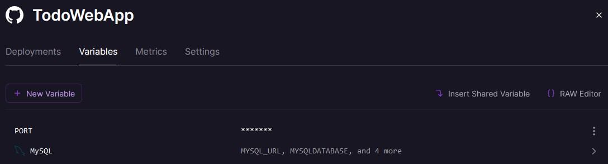

# TodoWebApp

Simple todo web app using ASP.Net 6 MVC with a MySQL database.

## Code Editors

### Visual Studio

- Just hit the green play button

### VS Code & others

- Install [.NET 6.0 SDK](https://dotnet.microsoft.com/en-us/download/dotnet/6.0) (6.0.400). This is the only version I know of that works in [Railway.app](https://railway.app/) at the time of creating this project. You can change the SDK version in `./global.json`.

- You can now run this command:

> Profiles are stored in `Properties/launchSettings.json`

```sh
$ dotnet watch run --launch-profile HotReload
```

## Railway Deployment

- Add a MySQL database and connect your github repo
- Once it is connected and your website is built add these vars:\
  
  > MySQL variables will be automatically generated. See [Program.cs](https://github.com/nadjitan/TodoWebApp/blob/master/Program.cs#L17) to know how it is consumed.
- `DOTNET_ENVIRONMENT`: Production
- `PORT`: 3000 _(It is usually this number but you can check it when your website is done building in the **Deployments** > **View Logs**)_
- Lastly add a property group in the `<AppName>.csproj` file. This property group will only be applied during production.

```xml
<PropertyGroup Condition="'$(Configuration)' != '' AND '$(Configuration)' != 'Debug'">
  <InvariantGlobalization>true</InvariantGlobalization>
  <EnvironmentName>Production</EnvironmentName>
</PropertyGroup>
```
